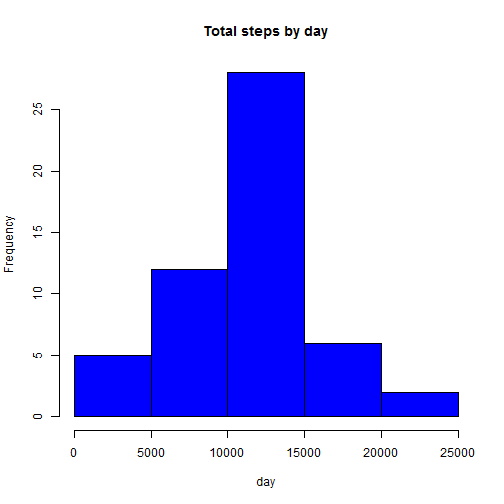

## Reproducible Research Peer Assessment 1

### Loading and preprocessing the data

```r
#unzip activity.zip file in the current working directory.Read data from csv file.
file<-"activity.zip"
unzip(file)
activity_data <- read.csv("activity.csv", colClasses = c("numeric", "character", "numeric"))
#change the character date column to a date type. 
activity_data$date <- as.Date(activity_data$date, "%Y-%m-%d")
#Verify that data is loaded correctly. activity_data stores entire dataframe read from csv file.
head(activity_data)
```

```
##   steps       date interval
## 1    NA 2012-10-01        0
## 2    NA 2012-10-01        5
## 3    NA 2012-10-01       10
## 4    NA 2012-10-01       15
## 5    NA 2012-10-01       20
## 6    NA 2012-10-01       25
```

### What is mean total number of steps taken per day?
Make a histogram of the total number of steps taken each day

```r
totalStepsPerDay <- aggregate(steps ~ date, data = activity_data, sum, na.rm = TRUE)
hist(totalStepsPerDay$steps, main = "Total steps by day", xlab = "day", col = "blue")
```

 

Mean and median total number of steps taken per day

```r
mean(totalStepsPerDay$steps)
```

```
## [1] 10766.19
```

```r
median(totalStepsPerDay$steps)
```

```
## [1] 10765
```

### What is the average daily activity pattern?
Make a time series plot (i.e. type = "l") of the 5-minute interval (x-axis) and the average number of steps taken, averaged across all days (y-axis)

```r
mean_interval_steps <- tapply(activity_data$steps, activity_data$interval, mean, na.rm = TRUE)
plot(row.names(mean_interval_steps), mean_interval_steps, type = "l", xlab = "Interval", 
     ylab = "Mean total no of steps", main = "Mean total no of steps per day", 
     col = "magenta")
```

 

Which 5-minute interval, on average across all the days in the dataset, contains the maximum number of steps?

```r
max_interval <- which.max(mean_interval_steps)
names(max_interval)
```

```
## [1] "835"
```
The interval 835 has the maximum average number of steps

### Imputing missing values
Calculate and report the total number of missing values in the dataset (i.e. the total number of rows with NAs)

```r
sum(!complete.cases(activity_data))
```

```
## [1] 2304
```
The total number of rows with NA's is 2304

Devise a strategy for filling in all of the missing values in the dataset. The strategy does not need to be sophisticated. For example, you could use the mean/median for that day, or the mean for that 5-minute interval, etc.

For performing imputation, replace the NA by the mean for that 5-minute interval. 


```r
activity_no_na <- na.omit(activity_data)
interval_mean_steps <- aggregate(steps ~ interval, activity_no_na, mean)
na_filled <- numeric()
#loop through activity_data and replace na with mean steps from interval_mean_steps
for (i in 1:nrow(activity_data)){
   if (is.na(activity_data$steps[i])){
     interval_val <- activity_data$interval[i]
     row_id <- which(interval_mean_steps$interval == interval_val)
     mean_steps <- interval_mean_steps$steps[row_id]
     steps <- mean_steps
   }else{
     steps<-activity_data$steps[i]
   }
   na_filled <- c(na_filled, steps)
}
```
Create a new dataset that is equal to the original dataset but with the missing data filled in.


```r
#na_filled_activity represents a new dataset with missing data filled in
na_filled_activity <- activity_data
na_filled_activity$steps <- na_filled
```
Make a histogram of the total number of steps taken each day and Calculate and report the mean and median total number of steps taken per day. Do these values differ from the estimates from the first part of the assignment? What is the impact of imputing missing data on the estimates of the total daily number of steps?

```r
interval_mean_steps_nafill <- aggregate(steps ~ date, data = na_filled_activity, sum, na.rm = TRUE)

hist(interval_mean_steps_nafill$steps, col='red', main="Histogram of total number of steps per day with NA filled", xlab="Total number of steps per day")
```

 

Mean and median of imputed data

```r
mean(interval_mean_steps_nafill$steps)
```

```
## [1] 10766.19
```

```r
median(interval_mean_steps_nafill$steps)
```

```
## [1] 10766.19
```

Mean and median of original data

```r
mean(totalStepsPerDay$steps)
```

```
## [1] 10766.19
```

```r
median(totalStepsPerDay$steps)
```

```
## [1] 10765
```
Due to data imputation, the means remain same but there is a vey small change in median value.

### Are there differences in activity patterns between weekdays and weekends?

Create a new factor variable in the dataset with two levels - "weekday" and "weekend" indicating whether a given date is a weekday or weekend day.

Make a panel plot containing a time series plot (i.e. type = "l") of the 5-minute interval (x-axis) and the average number of steps taken, averaged across all weekday days or weekend days (y-axis).

```r
library(lattice)
#Compute day factors as weekday or weekend
day <- weekdays(na_filled_activity$date)
dayFactor <- vector()
for (i in 1:nrow(na_filled_activity)) {
  if (day[i] == "Saturday") {
    dayFactor[i] <- "weekend"
  } else if (day[i] == "Sunday") {
    dayFactor[i] <- "weekend"
  } else {
    dayFactor[i] <- "weekday"
  }
}

#Use the dataset with the filled-in missing values for this part.
na_filled_activity$dayFactor <- dayFactor
na_filled_activity$dayFactor <- factor(na_filled_activity$dayFactor)

#compute the average number of steps taken, averaged across all weekday days or weekend days
stepsPerDay <- aggregate(steps ~ interval + dayFactor, data = na_filled_activity, mean)
names(stepsPerDay) <- c("interval", "dayFactor", "steps")

#Panel plot
xyplot(steps ~ interval | dayFactor, stepsPerDay, type = "l", layout = c(1, 2), 
       xlab = "Interval", ylab = "Number of steps")
```

 

From panel plots, we can see uniform pattern of activity during weekends but on weekdays, there is a spike in activity in early interval (700-1000 approximately)
